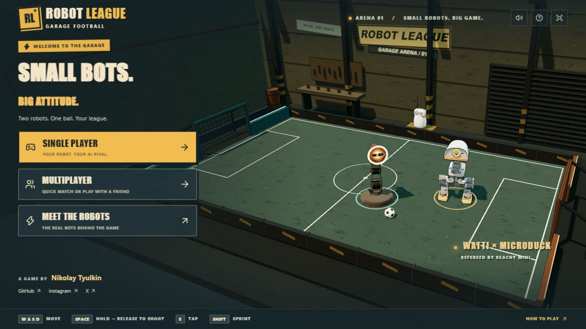
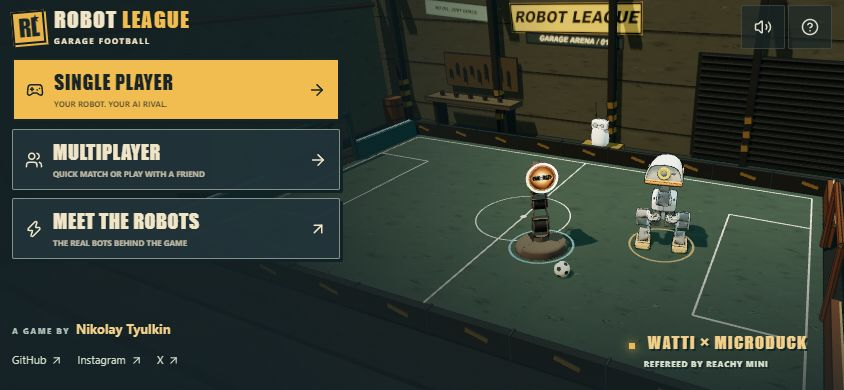
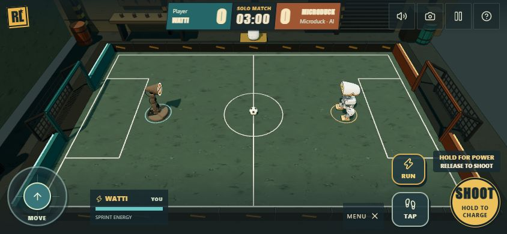

<div align="center">

# Robot League

**Small robots. Big attitude.** A comic football game for real robots — built to be extended with an AI coding agent.

<a href="https://rl.watti.dev"></a>

[Documentation](docs/README.md) · [Add a robot](docs/ADDING_ROBOTS.md) · [Create a mode](docs/ADDING_MODES.md)




</div>

Robot League puts Watti, Microduck and Reachy Mini on the same pitch. Play solo against the AI, match with someone online, or share a private room. Watti and Microduck stage the home screen while a separate Reachy Mini referees from the sideline.

The game has one shared TypeScript simulation: the solo game and authoritative multiplayer server use the same rules at 60 Hz. That makes it a practical base for people who want to bring their own robot model, animation, arena or football mode with an AI agent.

## ✨ Features

- **Three playable robots** — Watti, Microduck and Reachy Mini; mirror matches are supported.
- **Solo and multiplayer** — choose an AI opponent, find a quick match, or create a private room. Each player picks their own robot in the room.
- **Built for touch** — keyboard input and landscape phone controls, with hold-and-release charged shots.
- **Real model presentation** — CAD-derived models, rig-aware animation, comic outlines, a garage arena, and a separate referee.
- **Agent-friendly project** — the source map, extension checklists, asset rules, tests and deployment guide all live in this repository.

<div align="center">




</div>

## 🚀 Quickstart

With Docker:

```sh
docker compose up --build -d
```

Open [http://localhost:3000](http://localhost:3000). One container serves the game, `/ws` multiplayer endpoint and `/healthz`; no database or account is required.

For development, use the Node version in [.nvmrc](.nvmrc):

```sh
npm ci
npm run dev
```

Run the project checks before sharing a change:

```sh
npm run check
npm run build
npm run build:server
```

## 🎮 Controls

| Action | Keyboard | Landscape touch |
| --- | --- | --- |
| Move | WASD / arrows | Left stick |
| Sprint | Hold Shift | Hold RUN |
| Charged shot | Hold Space, then release | Hold SHOOT, then release |
| Short hit | E | TAP |
| Camera | C | Camera button |
| Solo pause | Escape | Pause button |

## 🧠 Make it yours with an AI agent

Start every substantial change with [AGENTS.md](AGENTS.md). It tells an agent where rules, rendering, networking, mobile controls and assets live, plus the behavior that must stay true.

**Add a robot** — read [Adding a playable robot](docs/ADDING_ROBOTS.md). Supply the model, creator, source revision and terms; the guide takes the agent through the rig, animation, selectors, server and QA.

**Create a game mode** — read [Adding match rules or modes](docs/ADDING_MODES.md). The guide follows a rule from the shared simulation through solo, rooms, reconnects and rematches.

Example prompt:

> Read AGENTS.md and docs/ADDING_ROBOTS.md. Add my robot from the supplied model and license. Preserve its assembly, give it deliberate idle, movement and strike animation, update solo and multiplayer selection, then verify keyboard, touch and a two-client room.

## 📖 Documentation

| Start here | What it covers |
| --- | --- |
| [Documentation index](docs/README.md) | Every guide, grouped by task |
| [Architecture](docs/ARCHITECTURE.md) | Simulation, renderer, networking and runtime flow |
| [Style guide](docs/STYLE_GUIDE.md) | Comic garage visual language, animation and mobile rules |
| [Deployment](docs/DEPLOYMENT.md) | Docker, nginx, HTTPS and operations |
| [Contributing](CONTRIBUTING.md) | Focused changes, checks and AI-assisted work |

## 🦾 Meet the robots

| Robot | Creator | Role on the pitch |
| --- | --- | --- |
| [Watti](https://github.com/Nikolay-Tyulkin/Watti) | Nikolay Tyulkin | A springy lamp with an expressive LED face |
| [Microduck](https://github.com/pollen-robotics/microduck) | Pollen Robotics | A biped with planted steps and quick kicks |
| [Reachy Mini](https://github.com/pollen-robotics/reachy_mini) | Pollen Robotics | A gliding player and separate referee |

Created by **Nikolay Tyulkin** · [GitHub](https://github.com/Nikolay-Tyulkin) · [Instagram](https://www.instagram.com/nikolay_tyulkin) · [X](https://x.com/NickTyulkin)

## 📄 Licenses

Original code is [MIT](LICENSE). The robot assets have their own terms: **Watti — CC BY-NC 4.0; Pollen Robotics models — upstream CC BY-SA-NC, version unspecified.** Read [License scope](LICENSES.md), [model sources](ASSETS.md) and [third-party notices](THIRD_PARTY_NOTICES.md) before redistributing the game or models.
