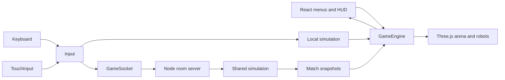

# Architecture

Robot League combines a React/Vinext interface, a Three.js renderer, a shared TypeScript simulation, and an authoritative Node WebSocket server. The committed GLB models are sufficient to run the game; Python and source CAD files are only needed when regenerating assets.

## Runtime and data flow



`app/page.tsx` mounts `game/Football.tsx`. `Football` owns menu/lobby/playing screens, the selected robot, solo opponent, nickname, socket lifetime, dialogs, and HUD state. It loads `GameEngine` on the client, which owns the canvas, scene, assets, animation loop, controls, audio, and cleanup.

`EngineInfo.mode` has three values:

- `demo`: a staged home-screen robot showcase.
- `solo`: local `step` calls with human input and `aiInput` for the opponent.
- `online`: server snapshots, local movement prediction, and interpolation of remote objects.

These are execution modes. There is currently one set of football rules, with no generalized mode or robot registry.

## Simulation and state

`game/sim.ts` exports `ROBOT_KINDS`, `ROBOT_NAMES`, `isRobotKind`, `SoloOpponent`, `selectSoloOpponent`, `RobotKind`, `Input`, `Player`, `Ball`, `GameEvent`, `MatchState`, and `Phase`, along with `createMatch`, `step`, `aiInput`, `finish`, and shared constants.

The pitch uses X/Z coordinates and Y for height. Heading is yaw in radians, with forward along +Z. `DT` is 1/60 second. The current match has two players, one ball, two goals, 180 seconds, and a five-goal target. Tied regulation time adds 60 seconds of sudden death; tied overtime ends in a draw.

`step` handles movement, energy, charging, timed actions, collisions, ball substeps, goal crossings, countdowns, and match completion. It does not access the DOM or renderer. Ball substeps and full-ball goal-plane checks prevent fast/diagonal shots from skipping scoring geometry. `aiInput` produces the same command shape as human controls.

Near a corner, AI approaches from the reachable inner diagonal, slows to align a short bank shot and steps aside after contact. It then resumes its normal goalward attack. This avoids chasing an unreachable point behind a ball at the boards or pinning the returning ball under the robot. Corner regression tests cover every corner, both attack sides, all kinds and jammed/transition poses.

Shared board contacts also apply after robot/post separation and reflect only outward velocities. When a board blocks ball separation, the robot absorbs the remaining displacement and part of the impulse. Successful outward bank shots within 36 cm of a solid board grant that striker a 0.35-second ball-contact clearance, extended only until an existing overlap clears. Opponent collisions remain active. This small arcade allowance lets manual shots escape corners; ordinary open-field shots and missed strikes receive no clearance, and stationary corner balls never escape automatically.

An `Input` contains `seq`, `x`, `z`, `sprint`, `charge`, `shoot`, and `tap`. Movement and held actions are state; shoot and tap are edges. A tap contacts at 0.09 seconds and a kick at 0.19 seconds after action start. Rendering must follow those times.

`MatchState.events` holds a bounded recent event history with increasing IDs. The renderer consumes new events once for sound and particles. Starting another match resets simulation counters; `GameEngine.snapshot` recognizes tick rollback and resets its corresponding presentation state.

## Input, rendering, and mobile layout

`GameEngine.input` combines keyboard and `TouchInput` into one command. Touch state lives outside React renders. `TouchControls` uses pointer capture and per-pointer ownership so moving, sprinting, and charging work simultaneously. Cancellation must release a control without creating an accidental shot. Controls are cleared on navigation, blur, hidden-page transitions, and relevant orientation/dialog changes.

`GameEngine` uses a fixed-step accumulator for solo simulation and a separate render loop. Online prediction smooths local movement; authoritative snapshots correct it. Movement speeds, acceleration, and field bounds are currently repeated in the prediction code, so changes must update both paths.

`Robot.load` loads `model.glb` and `rig.json`, applies model-specific materials, creates outlines, resolves joint nodes, and scales the model. `Robot.animate` receives authoritative player state. Instances are keyed by player ID and kind, with a separate referee; only the two active players and referee are visible. All three models are playable and mirrors retain independent poses/materials. Reachy glides on its base and uses a timed head strike. Watti’s flat LED diffuser and flexible cable endpoints follow its joints, including idle motion. `game/kinematics.ts` contains Microduck-specific leg IK and the Reachy Stewart-platform rod solver. See [Adding robots](ADDING_ROBOTS.md) for the contract.

Desktop uses overview and overhead camera choices. `game/mobile-camera.ts` fits the pitch and goals beneath the phone HUD with a small bottom margin. Workshop scenery and the referee are allowed to leave the frame. Its reference viewport height avoids unnecessary scale changes as browser chrome changes. `app/mobile.css`, imported after `globals.css`, applies compact controls, safe-area insets, and portrait guidance. See [Style guide](STYLE_GUIDE.md).

## Multiplayer and deployment

`game/network.ts` defines server messages and `GameSocket`. `server/index.ts` creates rooms, pairs the quick-match queue, validates commands, owns seats/tokens, and runs `step`. The protocol covers `queue`, `create`, `join`, `select-robot`, `ready`, `input`, `resume`, `rematch`, `leave`, and ping/pong. Server messages include room details, snapshots, queue acknowledgement, information, and errors.

Create/join/queue requests carry an initial kind. In the room, `select-robot` changes only the sender's server-owned seat and broadcasts both choices. A changed kind clears both ready flags; repeating the same kind does not. Choices lock once a match state exists and survive start, reconnect and rematch. Solo randomization excludes the player's kind and is resolved before `createMatch`, which remains deterministic for explicit kinds.

Each open page maintains a separate presence socket on `/ws` and registers with `presence`. The server broadcasts `{type: 'presence', online, queued}` as visitors connect/disconnect or the quick-match queue changes. `online` counts registered page connections (multiple tabs count separately), not unique accounts; the additional match socket does not register. `queued` counts waiting players, including the viewer when searching, and drops immediately when a pair enters a room. On connection loss, the UI marks counts unavailable and retries. These statistics are scoped to one server process.

The server simulates at 60 Hz using monotonic elapsed time and sends regular snapshots at 20 Hz. The client sends controls at approximately 30 Hz, immediately sending shot/tap edges. The server preserves these edges until a simulation tick consumes them and neutralizes stale movement after 350 ms.

Rooms currently hold exactly two seats. Private rooms and the public queue are separate. A disconnect preserves lobby seats/choices, clears readiness and allows a 15-second token-based return. In an active match it pauses play for the same return window. Explicitly leaving a lobby closes it immediately. Both connected players must request a rematch. State lives in one server process with no database or cross-process room coordination.

The default browser socket is same-origin `/ws`; `NEXT_PUBLIC_GAME_SERVER_URL` can override it. Development starts the web and match servers, with the Vite `/ws` proxy targeting the local match server. The Docker build uses:

```sh
npm run build:container
npm run build:server
```

`build:container` invokes Vinext with `BUILD_TARGET=docker`; `build:server` emits compiled server code. Docker copies the static client and server output into one Node runtime. The server provides static HTTP content, WebSocket upgrade at `/ws`, and health information at `/healthz`. Keep routing, origin validation, startup configuration, and shutdown behavior covered when changing deployment code. A separate frontend host needs a reachable server URL and matching allowed-origin configuration.

## Tests and extension boundaries

- `tests/sim.test.ts`: goal crossings, timing, actions, AI, pause and numeric stability.
- `tests/server.test.ts`: room/queue lifecycle, authoritative input, reconnect, rematch, and server behavior.
- `tests/mobile.test.ts`: independent touch ownership, cancellation, one-shot actions, and both camera projections.
- `tests/http.test.ts`: static serving, traversal/symlink rejection, Origin policy, connection limits, and bounded graceful shutdown.
- `scripts/smoke.mjs`: built HTTP/model delivery and a two-player WebSocket room against a running server.
- `scripts/assets/validate_assets.py`: GLB structure, finite geometry, hierarchy, unique names, and rig node references.
- `scripts/assets/verify_silhouettes.py`: source-versus-conversion silhouette comparisons.

Run `npm run check` for type checks, lint and tests. Exercise the relevant browser flow in addition to pure tests. New robots and new rules cross several files; use [Adding robots](ADDING_ROBOTS.md) and [Adding modes](ADDING_MODES.md) rather than assuming a registry already handles them.

Asset reuse is governed by [LICENSES.md](../LICENSES.md). Application code and model adaptations have different license scopes.
